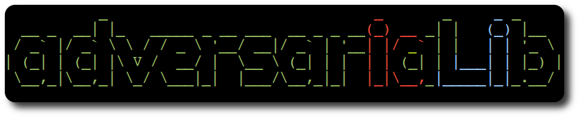
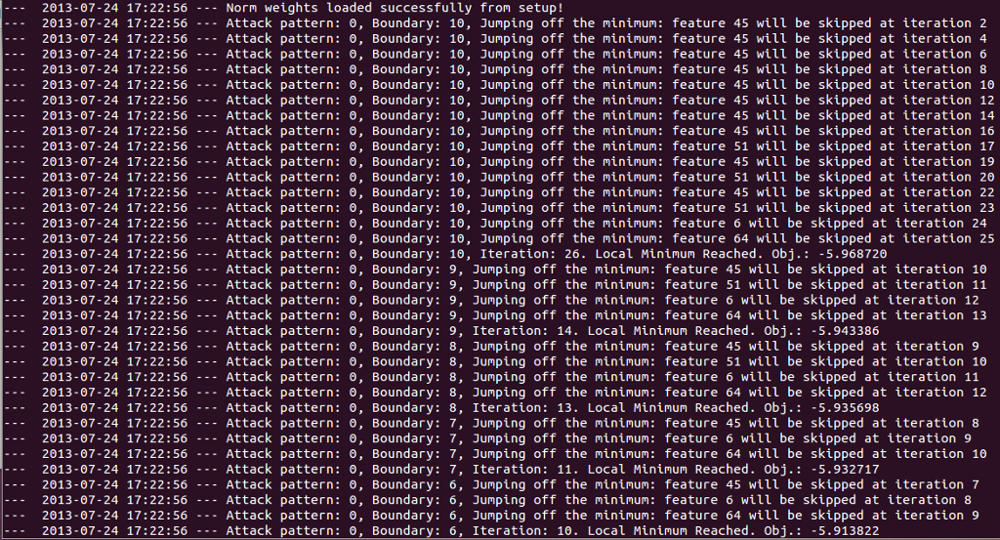

AdversariaLib's documentation
=============================

Contents:
	* `Adversarial Machine Learning`_
	* `About AdversariaLib`_
	* `Installation`_
	* `Usage Examples`_
	* `Developers Section`_
	* `Getting Help and Sending Suggestions`_
	* `Contribute`_
	* `Snapshots`_

.. toctree::
    :titlesonly:
    
    matlab

.. _`Adversarial Machine Learning`:

Adversarial Machine Learning
----------------------------

Machine-learning and pattern-recognition techniques such as Support Vector Machines (SVMs), Hidden Markov Models (HMMs), N-grams, Decision Trees, Artificial Neural Networks (ANN) are increasingly being adopted in security applications like spam filtering, network intrusion detection, and malware detection, due to their ability to generalize, and to potentially detect novel attacks or variants of known ones.

However, learning algorithms typically assume data *stationarity*: that is, both the data used to train the classifier and the operational data it classifies are sampled from the same (though possibly unknown) distribution. Meanwhile, in adversarial settings such as the above mentioned ones, intelligent and adaptive adversaries may purposely manipulate data (violating stationarity) to exploit existing vulnerabilities of learning algorithms, and to impair the entire system.

This has led to an arms race between the designers of learning systems and their adversaries. *Classical performance measures cannot be directly exploited to assess the security of machine learning algorithms and to measure the performance degradation they may incur under carefully targeted attacks.*

This raises several open issues, related to whether machine-learning techniques can be safely adopted in security-sensitive tasks, or if they must (and can) be re-designed for this purpose. In particular, the main open issues to be addressed include:

* **analyzing the vulnerabilities of learning algorithms;**
* **evaluating their security by implementing the corresponding attacks;**
* **designing suitable countermeasures**.

These issues are currently explored in the emerging research area of *adversarial machine learning*, at the intersection between computer security and machine learning.

.. _`About AdversariaLib`:

About AdversariaLib
-------------------

``AdversariaLib`` is a general-purpose library for the automatic evaluation of machine learning-based classifiers under adversarial attacks. It comes with a set of powerful features: 

* **Easy-to-use** Running sophisticated experiments is as easy as launch a single script. Experimental settings can be defined through a single setup file.
* **Wide range of supported ML algorithms** All supervised learning algorithms supported by scikit-learn_ (yes, they are a lot!), as well as Artificial Neural Networks (ANNs), by means of our scikit-learn wrapper for FANN_. In the current implementation, the library allows the security evaluation of SVMs having kernel either linear, or rbf, or polynomial, and ANNs having one hidden layer.
* **Fast Learning and Evaluation** Thanks to scikit-learn_ and FANN_, all supported ML algorithms are optimized and written in C/C++ language. Hopefully, this allows you to meet a conference deadline ;-)
* **Built-in attack algorithms** Gradient Descent Attack
* **Extensible** Other attack algorithms can be easily added to the library.
* **Multi-processing** Do you want to further save time? The built-in attack algorithms can run concurrently on multiple processors.

Last, but not least, ``AdversariaLib`` is **free software**, released under the `GNU General Public License version 3`_!

``Authors:`` `Igino Corona`_, `Battista Biggio`_, `Davide Maiorca`_, Pattern Recognition and Applications Lab, Dept. of Electrical and Electronic Engineering, University of Cagliari, Italy.

.. _`Installation`:

Installation
------------
 
``AdversariaLib`` is *multi-platform* software, built upon the scikit-learn_ framework. We tested it on `Ubuntu 13.04`_ and `Apple Mac OS X 10.8.4`_, but it can certainly run on other operating systems, such as Microsoft Windows.

1. Install all required packages: ``scikit-learn`` and ``pyfann``
	On **Ubuntu** (from command shell):
	::
		
		$ sudo apt-get install python-sklearn python-pyfann python-pip
		$ sudo pip install scikit-learn --upgrade

	On **Mac OS X**:
		1. Install the latest version of Xcode_ from the AppStore
		2. Install the latest version of macports_. If macports_ have been already installed please update them through the following shell commands:
			::
			
				$ sudo port selfupdate
				$ sudo port upgrade outdated

		3. Run the following instructions from command shell:
			::
			
				$ sudo port install py-scikit-learn py-setuptools

		4. Setup the python interpreter installed by macports (in our case, ``python27``) as default:  
			::

				$ port select --list python
				Available versions for python:
					none (active)
					python25-apple
					python26-apple
					python27
					python27-apple
				$ sudo port select --set python python27
				$ sudo mv /usr/bin/python /usr/bin/python.orig
				$ sudo ln -s /opt/local/bin/python /usr/bin/python
			
			**NOTE**: we are assuming that the default python interpreter corresponds to ``/usr/bin/python`` (run the ``which python`` instruction). You may **restore** your default python interpreter *anytime*, through the instructions:
				::

					$ sudo mv /usr/bin/python.orig /usr/bin/python

		5. We suggest to install our patched version of Python bindings for FANN within the AdversariaLib repository (``wrappers/fann-2.1.0`` folder), because the original one contains a bug in ``line 111`` of file ``pyfann.i``: check out the following `fann post`_. On UNIX-like OSs such as Mac OS X (open a shell inside ``wrappers/fann-2.1.0``):
			::

				$ chmod +x configure
				$ ./configure
				$ make
				$ cd python
				$ python setup.py install --user

			**NOTE**: the pyfann library is now accessible to the current user only. If you want a system-wide installation, please **substitute** the latter instruction with:
				::

					$ sudo python setup.py install
	
	For **other OSs**, please refer to:
		* `installation section of scikit-learn`_
		* See previous point (5) and the `installation section of FANN`_

	Please note that ``AdversariaLib`` has been tested with scikit-learn version *0.13.1* and pyfann version *2.1.0*.

2. Download ``AdversariaLib`` from the `official repository`_ and unpack it on a folder of your choice.

.. _`Usage Examples`:

Usage Examples
--------------

In order to provide a *quick-and-dirty* way for exploiting our adversariaLib and demonstrating its features, we prepared a set of sample `experiments`. For instance, performing a *Gradient Descent Attack* [ECML2013]_ against a *Linear Support Vector Machine* (Linear SVM), with full and partial knowledge of its training data is as easy as running the following instruction (from a shell within the main folder of the project):
::
	
	$ python adversariaLib/runexp.py experiments/svm_lin_attack

Similarly, it is easy to perform the same attack simulation against a *SVM with RBF kernel*:
::
	
	$ python adversariaLib/runexp.py experiments/svm_rbf_attack

...or against a *Multi-Layer Perceptron* (MLP), also known as Artificial Neural Network:
::
	
	$ python adversariaLib/runexp.py experiments/mlp_attack

We also demostrate how it is easy to simulate an attack against *MLP*, *Linear SVM* and *SVM with RBF kernel*, when the adversary does not know exactly the learning algorithm employed by the targeted classifier and thus `assumes` a *Linear SVM*:
::
	
	$ python adversariaLib/runexp.py experiments/svm_lin_attack_vs_multiple

General Notes
^^^^^^^^^^^^^
When an experiment is launched three subfolders are automatically created within the main folder of the experiment, namely, ``classifiers``, ``datasets``, ``tests``. ``adversariaLib`` further subdivides experimental data into two types: ``BASE`` and ``ATTACK``. ``BASE`` data is related to all standard procedures for learning and testing, while ``ATTACK`` data is related to attacks against classifiers/machine-learning algorithms.  This is the reason why each one of the three folders ``classifiers``, ``datasets``, ``tests`` contains two subfolders, namely, ``base`` (``exp_type=BASE``) and ``attack`` (``exp_type=ATTACK``). The attack folder is further populated with a subfolder having the name of (and data related to) the related attack (e.g., ``gradient_descent``).

Folders and File Format
"""""""""""""""""""""""
The output of an experiment consists of the standard (shell) output, containing real-time information about runtime operations, as well as **a number of files containing different kind of information**. In general, the folder:

* ``datasets/base`` contains: 
	* training (``tr``) and testing (``ts``) splits; filename format: ``<dataset_name>.<split_number>.<tr|ts>.txt``. Each line contains the index of the pattern associated to the dataset split. Each training/testing split is randomly sampled from the original dataset. 
	* the indexes of patterns related to each cross-validation fold: ``<dataset_name>.kfold``. This file contains cross-validation folds. We use the same for all training splits.

* ``classifiers/base`` contains all targeted classifiers; filename format: ``<targeted_classifier_type>.<dataset_name>.<split_number>.tr.cdat``. ``<targeted_classifier_type>`` is a keyword specified in the setup file, that identifies: training algorithm (e.g. linear SVM), as well as training settings (see the ``CLASSIFIER_PARAMS`` variable, described in `Experimental Parameters`_).

* ``tests/base`` contains all test scores/labels; filename format: ``<targeted_classifier_type>.<dataset_name>.<split_number>.ts.txt``. Each line contains (space-separated) score and label assigned by ``<targeted_classifier_type>.<dataset_name>.<split_number>.tr.cdat`` to the corresponding pattern in ``<dataset_name>.<split_number>.ts.txt``.

In addition, other files will be generated, according to the operations performed by each attack. See the following section for information stored by the *Gradient Descent Attack*.

Surrogate Classifiers
"""""""""""""""""""""
When an attack takes place, one or more *surrogate* classifiers are built for emulating the targeted classifier. 
Let us define as *surrogate classifier* the classifier whose parameters are known to the adversary. 
As a special case, when the attacker has got a perfect knowledge (i.e., defender's worst case), the surrogate classifier corresponds to the targeted classifier. 
For each testing split, one or more *surrogate* classifiers are trained on a random subset of it. 
In order to evaluate the average performance of an attack based on surrogate classifiers given a **fixed number of training samples**, 
it is possible to create multiple instances of them, sampling multiple times the same testing split.

.. _`Gradient Descent Attack Notes`:

Gradient Descent Attack Notes
^^^^^^^^^^^^^^^^^^^^^^^^^^^^^
Each main iteration of the attack corresponds to a different ``boundary_number``, i.e., a different constraint. 
The higher the ``boundary_number``, the less the constraint on the distance between a computed attack pattern and the root (initial) 
attack pattern given to the gradient-descent algorithm. See the ``max_boundaries`` option, described in `Experimental Parameters`_.

.. _`KDE distance`:

KDE distance 
""""""""""""
The KDE distance can be exploited by the mimicry component of the attack. We calculate the distance between an attack pattern and the distribution of a subset :math:`L` of legitimate patterns, estimated through `kernel density estimation`_. In particular, we consider only the :math:`|L|` legitimate patterns closest to the root attack pattern, i.e., the initial attack pattern given to the gradient-descent algorithm. Since we employ a gaussian kernel, the KDE distance can be expressed as follows:

.. math:: d_{kde}(x, L) = \frac{1}{|L|}\sum_{y \in L} e^{-\gamma d(x,y)}

where :math:`d(x,y)` is a generic distance measure between two patterns :math:`x` and :math:`y`.

.. _`Folders and File Format - Gradient Descent Attack`:

Folders and File Format
"""""""""""""""""""""""
When a gradient-descent attack takes place, runtime information about the attack is printed in the standard output, 
and a number of files are created. In particular, the folder:

* ``classifiers/attack/gradient_descent`` contains all surrogate classifiers; filename format: ``<surrogate_classifier_replica>@<targeted_classifier_type>.<dataset_name>.<split_number>.ts.cdat``. ``<surrogate_classifier_name>`` is further structured as follows: ``<surrogate_classifier_replica>=<surrogate_classifier_type>-<number_of_samples>-<repetition_number>``, where ``<surrogate_classifier_type>`` (analogously to ``<targeted_classifier_type>`` used for targeted classifiers) is a keyword specified in the setup file, that identifies: training algorithm (e.g. linear SVM), as well as training settings (see the ``SURROGATE_CLASSIFIER_PARAMS`` dictionary of the setup file, described in `Experimental Parameters`_). On the other hand, ``<number_of_samples>`` is the number of patterns used to train the *surrogate* classifier, **randomly** sampled from the corresponding testing split ``<dataset_name>.<split_number>.ts.txt`` within the ``datasets/base`` folder. Given a fixed number of training samples ``<number_of_samples>``, ``<repetition_number>`` uniquely identifies a sampling process, i.e., multiple *surrogate* classifiers can be trained using the *same number* of samples, and the attack's effectiveness can be averaged to limit bias errors on its evaluation.

	**NOTE**: if a relabeling strategy is followed (see the option ``relabeling``, described in `Experimental Parameters`_), all patterns used for training a *surrogate* classifier are labelled according to the output of the corresponding *targeted* classifier: ``<targeted_classifier>.<dataset_name>.<split_number>.tr.cdat``.

* ``datasets/attack/gradient_descent`` contains all computed attack patterns; filename format: ``<surrogate_classifier_replica>@<targeted_classifier_type>.<dataset_name>.<split_number>.ts.txt``. From the testing split ``<dataset_name>.<split_number>.ts.txt`` within ``datasets/base``, we extract *all* attack patterns. Each attack pattern is numbered incrementally and then used as **root** (initial) pattern for the gradient-descent attack. Thus, each line in ``<surrogate_classifier_replica>@<targeted_classifier_type>.<dataset_name>.<split_number>.ts.txt`` contains 
	1. incremental number of the root attack pattern. This is necessary to uniquely identify each root pattern if multiprocessing is employed; 
	2. all attack patterns computed starting from such root pattern. For each main iteration, we store the corresponding attack pattern. We separate one attack pattern from its subsequent through a comma: "," , whereas each feature pertaining to an attack pattern is space-separated.

	**NOTE**: Please recall that attack patterns are computed applying the gradient-descent attack to the *surrogate classifier*, that may be either a *surrogate* or the *targeted* classifier itself.

* ``tests/attack/gradient_descent`` contains all scores related to attack patterns; filename format: ``<targeted|surrogate>_[<surrogate_classifier_replica>@]<targeted_classifier_type>.<dataset_name>.<split_number>.ts.txt``. Each line contains:
	1. incremental number of the root attack pattern, this is necessary to uniquely identify each root pattern if multiprocessing is employed;
	2. the score of each attack patterns computed starting from such root pattern. For each main iteration, we store the score of the corresponding attack pattern. Scores are space-separated.

	**NOTE**: If the filename has prefix ``targeted`` means that scores are related to the *targeted* classifier, otherwise (prefix ``surrogate``) scores are related to the *surrogate* classifier. If the surrogate classifier corresponds to the targeted classifier (perfect knowledge) we skip the declaration of ``<surrogate_classifier_replica>@``, i.e., scores are saved within a filename with the following format: ``targeted_<targeted_classifier_type>.<dataset_name>.<split_number>.ts.txt``.

.. _`Experimental Parameters`:

Experimental Parameters
^^^^^^^^^^^^^^^^^^^^^^^
Here follows a description of experimental parameters, with reference to the *Gradient Descent Attack* whose settings are specified in ``experiments/svm_lin_attack/setup.py``. By means of this example, we want to guide the interested reader to the definition of all experimental settings supported by the current version of ``AdversariaLib``. 
::

	import numpy as np
	from os.path import realpath, dirname, join, abspath
	from util.vars import dotdictify, BASE
	
	EXP_PATH = dirname(realpath(__file__))
	DSET_FOLDER = abspath(join(EXP_PATH, '../../dataset'))
	DSET_NAME = 'norm_pdf_med'
	
	TEST_FRACTION = 0.15
	NFOLDS = 3
	NSPLITS = 3
	CLASSIFIER_PARAMS = dotdictify({
		'SVM_lin': {
			'lib': 'sklearn.svm.SVC',
			'common': {'kernel': 'linear'},
			'grid_search': {'param_grid': dict(C=np.logspace(-3, 2, 6))},
		},
	})
	
	GRID_PARAMS = dotdictify({'iid': True, 'n_jobs': 1})
	
	NORM_WEIGHTS_FILEPATH = join(DSET_FOLDER, 'norm_weights.txt')
	NORM_WEIGHTS = np.array([float(item) for item in open(NORM_WEIGHTS_FILEPATH).read().split()])
	
	SURROGATE_CLASSIFIER_PARAMS = CLASSIFIER_PARAMS
	
	ATTACK_PARAMS = dotdictify({
		'gradient_descent': {
			'attack_class': 1, 'maxiter': 500,
			'score_threshold': 0, 'step':0.01,
			'fname_metachar_attack_vs_fname_metachar_surrogate_vs_targeted': '@',
			'fname_metachar_samples_repetitions': '-',
			'constraint_function': 'only_increment', 'constraint_params': {'only_increment_step': 1},
			'stop_criteria_window': 20, 'stop_criteria_epsilon': 10**(-9), 'max_boundaries': 10,
			'lambda_value':10, 'mimicry_distance': 'kde_hamming', 'relabeling': True,
			'mimicry_params' : {'max_leg_patterns': 100 , 'gamma': 0.001},
			'save_attack_patterns': True, 'threads': 1,
			'training': {
				'dataset_knowledge': {'samples_range': range(50,100,50), 'repetitions': 1},
			},
		},
	})

* ``EXP_PATH``: path of the main folder of the experiment (where ``setup.py`` is stored)
* ``DSET_FOLDER``: absolute path of the folder containing the dataset; in this case, we go two levels up with respect the folder containing ``setup.py`` (i.e., ``EXP_PATH``) to find the ``ECML_Dataset`` folder.
* ``DSET_NAME``: name of the dataset, excluding its `.txt` extension. Each sample within dataset ``norm_pdf_med`` is related to either legitimate (class label=-1) or malicious (class label=1) PDF files. Each PDF sample is described by one line where each feature is space-separated and the last value indicates its class label. Each feature is the *normalized* occurrence (count) of a specific name object within a PDF document. More details about this dataset are available in our research publication [ECML2013]_.
* ``TEST_FRACTION``: dataset fraction reserved for testing classifiers. Testing data is *randomly* sampled from the original dataset ``NSPLITS`` times. 
*  ``NSPLITS``: please, see ``TEST_FRACTION``.
* ``NFOLDS``: number of folds to be used for cross-validation on training data.
* ``CLASSIFIER_PARAMS``: a `python dictionary`_, where each key-value pair describes a targeted classifier to be built. Each classifier is characterized by a unique key (e.g. ``'SVM_lin'``) and a value (dictionary) specifying its training settings.  In particular, such a dictionary must specify the following keys:
	* ``'lib'``: the base class for the classifier (e.g. `sklearn.svm.SVC`_). Please note that this string will be used internally to ``import`` the class for building the classifier (e.g. ``'lib': 'sklearn.svm.SVC'`` corresponds to the python instruction ``from sklearn.svm import SVC`` and a ``SVC`` object will be instantiated). Thanks to this approach, ``adversariaLib``:
		* can support all classifiers defined in ``scikit-learn``, accross multiple versions
		* can support any other Pickable_ classifier that provides at least the following ``scikit-learn``-compatible methods :func:`fit()`, :func:`predict()` and :func:`decision_function()`. See, for instance, our MLP wrapper for ``scikit-learn`` in ``adversariaLib/prlib/classifier/mlp.py``. See also how this classifier is referenced in ``experiments/mlp_attack/setup.py``.
	* ``'common'``: parameters of the classifier's constructor. Such parameters are passed using a dictionary where each key-value is *attribute name* (i.e., a *string*) and its *value*. For instance, considering the above setup, ``'common': {'kernel': 'linear'}`` will lead to the following object instantiation ``SVC(kernel='linear')``.
	* ``'grid_search'``: classifier settings for cross-validation. All attributes specified for `sklearn.grid_search.GridSearchCV`_ are supported, however, the most important attribute is ``param_grid``. The value of this attribute should be a dictionary where, for each classifier parameter, an array of values to be tested is specified. For instance, considering the above setup, ``dict(C=np.logspace(-3, 2, 6))`` corresponds to the dictionary ``{'C': array([1e-03, 1e-02, 1e-01, 1e+00, 1e+01, 1e+02])}`` (see numpy.logspace_), which means that during the cross-validation process, the classifier accuracy will be evaluated considering the following values ``C in [0.001, 0.01, 0.1, 1, 10, 100]``.
* ``GRID_PARAMS``: this parameter has the same objective of ``param_grid``, but it is useful to define cross-validation settings that are in common between all classifiers. In particular, considering the above setup file, we can define (see `sklearn.grid_search.GridSearchCV`_ for more details):
	* ``'iid'``: must be set to ``True`` or ``False``. If we set ``True``, the data is assumed to be identically distributed across the folds, and the loss minimized is the total loss per sample, and not the mean loss across the folds.
	* ``'n_jobs'``: concurrent threads (jobs) for cross-validation. Setting a value higher than 1, can significantly speed up cross-validation on systems with multiple processors.
* ``NORM_WEIGHTS_FILEPATH``:  path of the file containing normalization weights, i.e., a (space-separated) integer value for each feature. Original patterns can be obtained multiplying each normalized feature value by its corresponding weight. Given ``NORM_WEIGHTS_FILEPATH``, we extract ``NORM_WEIGHTS``, i.e., the actual array of normalization weights. It is an array containing a list of normalization weights for patterns within the loaded dataset. Such weights are such that multiplying element-by-element ``NORM_WEIGHTS`` for each (normalized) pattern within the dataset, we get back the original (unnormalized) feature vector. This variable is optional, and if not specified, each feature will receive the same weight during the gradient-descent attack.
* ``NORM_WEIGHTS``: please, see ``NORM_WEIGHTS_FILEPATH``.
* ``SURROGATE_CLASSIFIER_PARAMS``: dictionary analogous to ``CLASSIFIER_PARAMS``, but dedicated to *surrogate* classifiers, i.e., classifiers built using a (random) portion of testing data (see ``TEST_FRACTION``). These *surrogate* classifiers can be used to emulate the behavior of an adversary who has partial knowledge of the target classifier, but can sample a portion of *testing* data during its operational phase. 
* ``ATTACK_PARAMS``: a dictionary where each key-value pair describes a machine-learning attack to be performed. Each key of this dictionary uniquely identifies an attack technique, whereas the related value defines all attack parameters in the form of a (sub)dictionary. Please note that **all** attack settings might specify a ``'training'`` parameter (and the related sub-paramaters, as described in the following), whereas all other parameters are *attack-specific*. Currently, ``adversariaLib`` comes with ``'gradient_descent'`` (``adversariaLib/advlib/attacks/gradient_descent/gradient_descent.py``), that is, the implementation of the *Gradient Descent Attack* described in [ECML2013]_. New attacks can be easily added to the library, inserting their implementation within folder ``adversariaLib/advlib/attacks/``. Each *gradient descent* attack setting may define the following keys:
	* ``'attack_class'``: label of attack patterns, in this case, ``1``. This parameter is needed to identify all attack patterns within all testing portions of the dataset.
	* ``'maxiter'``: number of maximum modifications of a root pattern during the attack
	* ``'score_threshold'``: score threshold of the attacked classifier. It may be a surrogate classifier (partial knowledge) or the targeted classifier (full knowledge).  
	* ``'step'``: incremental step at each iteration along the feature-space direction which minimizes the gradient. It is exacltly the *t* parameter described in [ECML2013]_.
	* ``'max_boundaries'``: defines the maximum number of *main* iterations to be performed. Let ``boundary_number in [1,max_boundaries]`` be an integer that identifies each main iteration of the gradient-descent algorithm. Each main iteration corresponds to a different ``boundary_number``, i.e., a different constraint. The higher the ``boundary_number``, the less the constraint on the distance between a computed attack pattern and the root (initial) attack pattern given to the gradient-descent algorithm. Such distance is defined (and enforced) by the ``'constraint_function'`` option.
	* ``'constraint_function'``: specifies the function that applies a constraint to each attack pattern computed by the gradient-descent attack. These functions are implemented in ``adversariaLib/advlib/attacks/gradient_descent/constraints.py``. The current implementation of ``adversariaLib`` comes with the following options:
		* ``None``: no constraints are applied to attack patterns, i.e., all computed attack patterns are accepted. This option is useful for testing purposes
		* ``'box'``: forces each attack pattern to be confined within a hypercube centered on the root attack pattern. It receives one attribute (specified through the ``'constraint_params'`` parameter, described in the following):
			* ``'box_step'``: this defines the box side dimension at each iteration: ``box side = box_step * boundary_number`` (see the ``'max_boundaries'`` option).

			**NOTE**: This option currently does not handle normalization weights, thus it is suggested to use it on a unnormalized dataset. Hence, if you select this option, you should *not* specify the ``NORM_WEIGHTS`` variable.
		* ``'hamming'``: forces each attack pattern to be confined within ``hamming distance = boundary_number`` from the root attack pattern (see the ``'max_boundaries'`` option).
			**NOTE**: This option does not need normalization weights, since it is expected to work with binary features. Thus, if you select this option, you should *not* specify the ``NORM_WEIGHTS`` variable.
		* ``'only_increment'``: each feature of an attack pattern must have a value higher or equal to that of the root attack pattern. This reflects a real constraint of PDF samples in ``'norm_pdf_med'``. That is, an attacker can easily **add** arbitrary *name objects* to a PDF file (by means of the *Adobe PDF versioning mechanism*), while it is much more difficult to **remove** them, to evade detection and retain the PDF's original malicious behavior. Such constraint function receives the following attributes (specified through the ``'constraint_params'`` parameter, described in the following):
			* ``'only_increment_step'``: it defines the maximum number of feature increments, according to: ``feature_increments = only_increment_step * boundary_number`` (see the ``'max_boundaries'`` option).
			* ``'feature_upper_bound'`` (integer, optional): it forces an upper bound to each feature of attack patterns (in the **unnormalized** space)   
	* ``'constraint_params'``: this parameter specifies the list of attributes required by the selected ``'constraint_function'`` option. If no attributes are required, an empty dictionary should be specified, i.e., ``'constraint_params': {}``
	* ``'stop_criteria_window'``: number of elements of the array employed by the stop criteria. In the above setup example, this option has value ``20``, which means that the gradient-descent algorithm **stops** if within 20 iterations (not to be confused with main iterations) the decrement of the objective function is less than ``'stop_criteria_epsilon'``.
	* ``'stop_criteria_epsilon'``: it corresponds to the :math:`\epsilon` parameter of the algorithm [ECML2013]_, and defines a little constant that is used to stop the algorithm if the objective function did not decrease significantly within the last ``'stop_criteria_window'`` iterations
	* ``'lambda_value'``: it corresponds to the :math:`\lambda` parameter of the algorithm [ECML2013]_, and reflects the tradeoff between density-based component (essentially this depends on training data only) and classifier component (it depends on the parameters of the *surrogate* classifier) when defining the objective function
	* ``'mimicry_distance'``: it defines the function that should be used to calculate the distance between an attack pattern and legitimate patterns. Please note that, for performance reasons, only subset of ``'max_leg_patterns'`` legitimate patterns closest to the root attack pattern, are considered. These functions are implemented in ``adversariaLib/advlib/attacks/gradient_descent/gradient_distances.py``. The current implementation of ``adversariaLib`` comes with the following options:
		* ``'euclidean'``: calculates the distance between an attack pattern and its closest legitimate pattern.
		* ``'kde_euclidean'``: calculates the distance between an attack pattern and the distribution of legitimate patterns, estimated through kernel density estimation, where :math:`d(x,y)` is the *euclidean* distance between pattern :math:`x` and :math:`y`. See the above section on `KDE distance`_.
		* ``'kde_hamming'``: calculates the distance between an attack pattern and the distribution of legitimate patterns, estimated through kernel density estimation, where :math:`d(x,y)` is the *hamming* aka *manhattan* aka :math:`l1` distance between two patterns :math:`x` and :math:`y`. See the above section on `KDE distance`_.
		
		All functions accept the attribute ``'max_leg_patterns'``, whereas functions ``'kde_euclidean'`` and ``'kde_hamming'`` accept also the ``'gamma'`` attribute (it shapes the gaussian kernel, see the :math:`\gamma` parameter of the `KDE distance`_). They all are optional, and can be specified by means of the ``'mimicry_params'`` parameter (see below for default values).
	* ``'relabeling'``: it may be ``True`` or ``False``. If ``True``, all patterns used for training *surrogate* classifiers are labelled according to the output of the corresponding *targeted* classifier. In this case, we are emulating an adversary who actively queries the targeted classifier to re-label each pattern before training a *surrogate* classifier.
	* ``'mimicry_params'``: attributes associate to the chosen ``'mimicry_distance'`` option. In the above ``setup.py``, we have set: 
		* ``'max_leg_patterns'``: ``100`` (default value: ``10``) 
		* ``'gamma'``: 0.001  (default value: ``0.1``) 
	* ``'save_attack_patterns'``: it may be ``True`` or ``False``.  If ``True``, all computed attack patterns are saved (within the folder ``dataset/attack/gradient_descent/``).
		**NOTE**: if you set  ``'save_attack_patterns': True`` and ``'max_boundaries': 1``, all attack patterns, related to the *base* iterations performed until a local minimum is reached, will be saved. This behavior is useful for testing purposes.
	* ``'threads'``: number of concurrent processes to be used for the gradient-descent attack. Values higher than one may greatly speedup the experimental process. If we set ``-1``, ``adversariaLib`` will launch as many processes as the number of CPUs of the machine (maximum theoretical speed).
	* ``'training'``: (optional) this section is dedicated to the definition of training parameters for *surrogate* classifiers
		* ``'dataset_knowledge'``: this section is dedicated to the definition of the dataset knowledge gained by the adversary 
			* ``'samples_range'``: a `python list`_ where each element is the number of samples to be used for training a *surrogate* classifier. An easy way to define such list is by means of the ``range(start,stop,step)`` function. Please, note that the stop value is never included in the list. For instance: ``range(50,250,50)`` produces a list with four elements: ``[50, 100, 150, 200]``, whereas ``range(50,250,50)`` produces a list with a unique element: ``[50]``. 
			* ``'repetitions'``: number of classifiers to be trained (repetitions) for each number (element) specified in the ``'samples_range'`` list. Please note that each repetition prefigures random sampling of a fixed number of elements from the same testing split. 
		
		**NOTE**: when ``training`` is specified, the algorithm automatically considers the dictionary ``SURROGATE_CLASSIFIER_PARAMS``, that specifies what learning algoritms should be used to build *surrogate* classifiers. In the above ``setup.py`` we have exactly the same dictionary, thus *surrogate* classifiers will be built using the same learning algorithm of targeted classifiers (i.e., linear SVM). Please note that the number of *surrogate* classifiers built is thus given by the number of algorithms specified in this dictionary (i.e., the number of **keys**), multiplied by the number of elements in ``'samples_range'``, multiplied by the number of ``'repetitions'``, multiplied by the number of (testing) splits ``NSPLITS``. Thus, each *surrogate* classifier is uniquely identified (thorugh its file name) given its: (a) training algorithm key (e.g. SVM_lin), (b) number of training samples, (c) number of the sampling repetition, (d) testing split.
	* ``'fname_metachar_surrogate_vs_targeted'``: This attribute specifies what meta-character should be used to separate the name of the *surrogate classifier* and that of the *target classifier* in a file name. In the section: `Folders and File Format - Gradient Descent Attack`_, as well as, in the above ``setup.py``, we employed a ``'@'`` meta-character.
	* ``'fname_metachar_samples_repetitions'``: This attribute specifies what meta-character should be used to separate number of samples and the number of the repetition, within the name of *surrogate* classifiers. In the section: `Folders and File Format - Gradient Descent Attack`_, as well as, in the above ``setup.py``, we employed a ``'-'`` meta-character. 

.. _`Developers Section`:

Developers Section
------------------
This section is of interest to anyone who wants to extend/improve adversariaLib. Are you interested in? You can `Contribute`_.

Adding New Attacks
^^^^^^^^^^^^^^^^^^
Each attack must be identified by a unique name (with no space characters) within adversariaLib.  
An attack can be launched by specifying its name as keyword of the ``ATTACK_PARAMS`` dictionary, within a ``setup.py`` file.
This is because the ``runexp.py`` script considers each key specified in ``ATTACK_PARAMS`` as the name of the attack function 
that can be loaded from the ``advlib/attacks`` folder.

For instance, let us refer to the setup file ``experiments/svm_lin_attack/setup.py``.
The runexp.py script automatically tries to perform the following import:

::

		from advlib.attacks import gradient_descent
		
since ``ATTACK_PARAMS`` contains the key ``'gradient_descent'``. Let us refer to ``attack_name`` as the name of the function that implements an attack.
In general, each ``attack_name`` function must define the following general interface:
::

	def attack_name(setup, X, y, y_t, surrogate_training_indexes, surrogate_classifier, targeted_classifier, attack_params, fnames):
		...
			
where:

* ``setup`` is the main setup object, that can be used to retrieve any variable specified in ``setup.py``
* ``X`` is the whole set of patterns in the current testing split (``numpy.array`` instance)
* ``y`` is the whole set of true labels for patterns in ``X`` (``numpy.array`` instance)
* ``target_classifier``: the target classifier (a `scikit-learn`_ classifier)
* ``y_t``: the whole set of labels assigned by ``target_classifier`` to each pattern in ``X`` (``numpy.array`` instance).  
* ``surrogate_classifier``: the surrogate classifier that should be attacked (a `scikit-learn`_ classifier)
* ``surrogate_training_indexes``: the array of indexes of patterns in ``X`` employed for building the surrogate classifier
* ``attack_params``: all parameters specified in the setup file. It corresponds to ``setup.ATTACK_PARAMS.attack_name``
* ``fnames``: contains different filenames
	* ``fnames.surrogate_score``: full path of the file where ``attack_name`` should store the score of the surrogate classifier associated to each attack iteration (for instance, ``gradient_descent`` stores the score assigned by the surrogate classifier to the attack pattern computed at each iteration) 
	* ``fnames.targeted_score``: full path of the file where ``attack_name`` should store the score of the targeted classifier associated to each attack iteration  (for instance, ``gradient_descent`` stores the score assigned by the targeted classifier to the attack pattern computed at each iteration) 
	* ``fnames.data``: full path of the file where ``attack_name`` should store other data about the attack for each iteration (for instance, ``gradient_descent`` stores the attack pattern computed at each iteration) 

``adversariaLib`` automatically submits such variables to each attack function.

Adding new classifiers
^^^^^^^^^^^^^^^^^^^^^^
It is straightforward to add new classifiers to ``adversariaLib``. This operation is useful to evaluate classification algorithms that are not implemented in scikit-learn_, for instance, robust versions of a particular classification algorithm. 
In order to be recognized by scikit-learn_ each classifier should

* be a subclass of ``BaseEstimator`` and ``ClassifierMixin`` classes defined in scikit-learn_ (``sklearn.base``)
* implement the following methods:

	* ``fit(X,y)`` that trains the classifier using the specified patterns ``X`` and their labels ``y``
	* ``predict(x)``, that returns the label predicted by the classifier to pattern ``x``
	* ``decision_function(x)``, that returns the score assigned by the classifier to pattern ``x``

In the following we provide a general template for the definition of new classifiers that are recognized by scikit-learn_. You should save the related ``.py`` file within the ``prlib/classifier`` folder of the library.
::

	from sklearn.base import BaseEstimator, ClassifierMixin
	class new_classifier(BaseEstimator, ClassifierMixin):
		def __init__(**init_params):
			...
		def fit(self, X, y):
			...
		def predict(self, x):
			...
		def decision_function(self, x):
			...
		
You might also take a look to our scikit-learn_ wrapper for FANN_ classifiers also known as Multi-Layer Perceptron, implemented in ``prlib/classifier/mlp.py``.

.. _`Getting Help and Sending Suggestions`:

Help and Suggestions
--------------------

Did you encounter any problem? Did you find any bug? Would you like to send suggestions? Please use the `forum on the official repository of adversariaLib`_.

.. _`Contribute`:

Contribute
----------

Are you a researcher working on adversarial Machine Learning? Would you like to contribute to this project? Feel free to contact us by email:

* `Igino Corona`_, `Battista Biggio`_. Mail to: ``<name>.<surname>@diee.unica.it``.

.. _`Snapshots`:

Snapshots
---------

.. _scikit-learn: http://scikit-learn.org/stable/supervised_learning.html
.. _Python: http://www.python.org
.. _`GNU General Public License version 3`: http://www.gnu.org/licenses/gpl.txt
.. _`Igino Corona`: http://pralab.diee.unica.it/en/IginoCorona
.. _`Battista Biggio`: http://pralab.diee.unica.it/en/BattistaBiggio
.. _`Davide Maiorca`: http://pralab.diee.unica.it/en/DavideMaiorca
.. _FANN: http://leenissen.dk/fann/wp/
.. _`Ubuntu 13.04`: http://releases.ubuntu.com/raring/
.. _`Apple Mac OS X 10.8.4`: http://www.apple.com/it/osx/
.. _Xcode: https://developer.apple.com/xcode/
.. _macports: https://www.macports.org/install.php
.. _`official repository`: https://sourceforge.net/projects/adversarialib/files/adversarialib_v1.0/
.. _`installation section of scikit-learn`: http://scikit-learn.org/stable/install.html
.. _`installation section of FANN`: http://leenissen.dk/fann/html/files2/installation-txt.html
.. _`fann post`: http://leenissen.dk/fann/forum/viewtopic.php?f=17&t=588
.. _`python dictionary`: http://docs.python.org/2/library/stdtypes.html
.. _`python list`: http://docs.python.org/2/tutorial/datastructures.html
.. _`sklearn.svm.SVC`: http://scikit-learn.org/stable/modules/svm.html#svc
.. _Pickable: http://docs.python.org/2/library/pickle.html
.. _`sklearn.grid_search.GridSearchCV`: http://scikit-learn.org/dev/modules/generated/sklearn.grid_search.GridSearchCV.html
.. _numpy.logspace: http://docs.scipy.org/doc/numpy/reference/generated/numpy.logspace.html
.. _`kernel density estimation`: http://en.wikipedia.org/wiki/Kernel_density_estimation
.. _`European Conference on Machine Learning and Principles and Practice of Knowledge Discovery in Databases* (ECML-PKDD 2013)`: http://www.ecmlpkdd2013.org
.. _`forum on the official repository of adversariaLib`: https://sourceforge.net/p/adversarialib/discussion/?source=navbar

Bibliography
------------

.. [ECML2013] Biggio B., Corona I., Maiorca D., Nelson B., Srndic N., Laskov P., Giacinto G., Roli F., :download:`Evasion attacks against machine learning at test time <Biggio13-ecml.pdf>`, in `European Conference on Machine Learning and Principles and Practice of Knowledge Discovery in Databases* (ECML-PKDD 2013)`_, Prague, Czech Republic, 2013.
